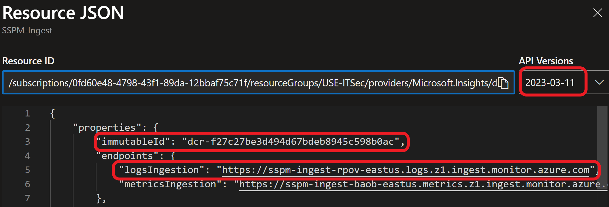
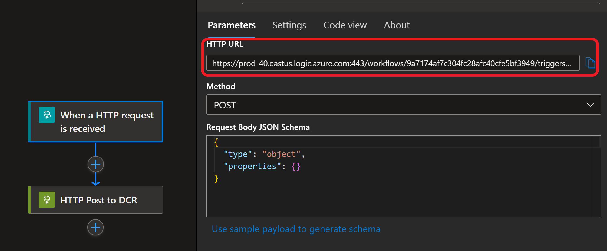
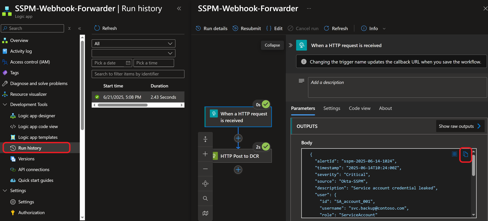
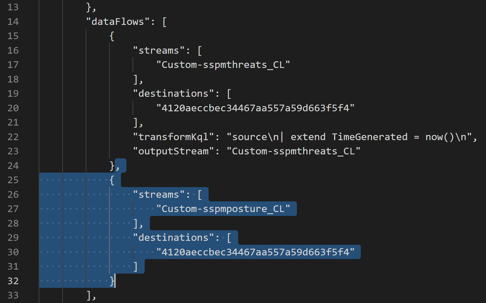
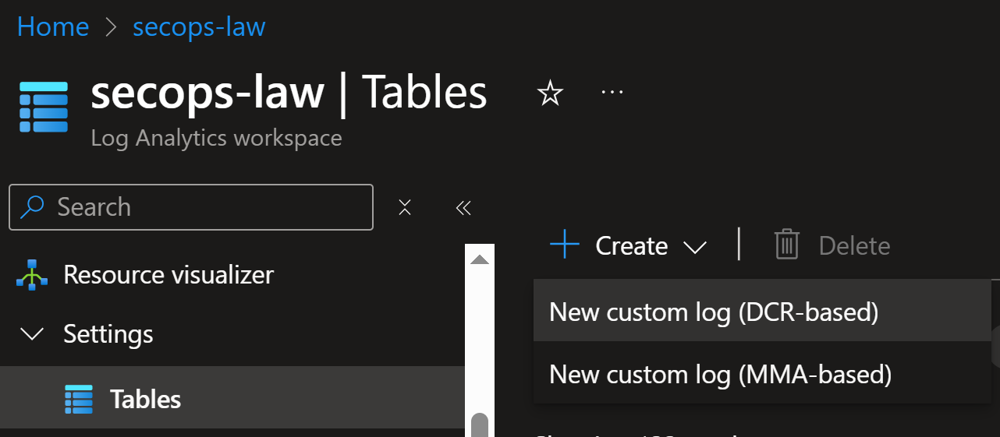
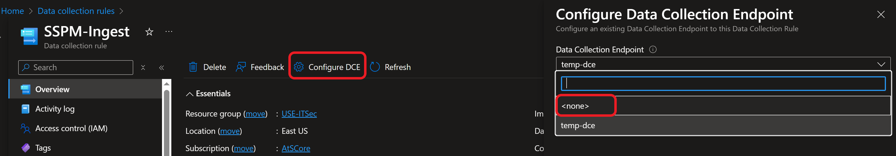

+++
title = "Webhook to Data Collection Rule with Direct Ingest"
date = 2025-06-22T09:14:15-04:00
categories = ["XDR", "DCR", "Azure Monitor"]
tags = ["API", "Log Ingestion", "Instructional", "Data Collection", "AMA", "Azure Monitor"]
authors = ["Dylan Tenebruso"]
description = ""
draft = true
+++
A little while ago I wanted to bring alerts from a few third-party tools over to Sentinel so the SOC didn't have to perform portal gymnastics. I didn't want to go through the hassle of configuring syslog, create any unnecessary resources, nor have to perform portal gymnastics of my own. I needed two separate Log Analytic tables, one DCR and one simple way to receive the alert data.

I wanted something scalable and repeatable. So I created a script, with the help of Google's Gemini, to make this process much simpler.

## The Simple Flow
Here's the path we'll build:

**Tool → Logic App → DCR → Sentinel (LAW)**

And with the script, what could've been (was) a fairly painful blog post to write, can be broken down into 4 simple steps:
1) Run the script to create the first Table and DCR
2) Run again to add the second Table and it's data stream to the existing DCR
3) Deploy the Logic App and paste your constructed direct ingestion urls
4) Assign the Logic App access to publish data to the DCR

### The Script


[]



This script streamlines the process of:

* Generating a Log Analytics table schema from an example payload JSON file. (Don't have this? We'll get you one int he Logic App Configuration section)

* Deploying or updating a custom Log Analytics table.

* Creating a new Direct-ingest DCR or adding a new stream to an existing DCR.

#### Prerequisites

Before running this script, ensure you have:

* **Azure PowerShell modules:** `Az.OperationalInsights` installed. The script will attempt to install it if missing.

* **Azure CLI:** Installed and authenticated (`az login`). The script uses Azure CLI to get access tokens.

* **Permissions:** Sufficient Azure RBAC permissions to create/manage Log Analytics Workspaces, Tables, Logic Apps, and Data Collection Rules in your subscription and resource group. (Log Analytics Contributor on the LAW; Monitoring Contributor & Logic App Contributor on the resource group; Reader on the Subscription)

* **PowerShell:** Version 5.1 or newer.

* **Sample JSON File:** A valid JSON file representing the structure of your custom logs.


#### Post-Script Procedures

After you've run the script, head to your DCR and on the Overview page, click "JSON view". On the JSON view blade change the API version to "2023-03-11". At the top of the resource definition you'll notice 2 URLs, logIngestion and metricIngestion.



##### Construct Direct Ingest URL
Open your favorite text editor and copy+paste the following:
```text
{logIngestion url}/dataCollectionRules/{DCR Immutable ID}/streams/{Stream Name}?api-version=2023-01-01
```
1) Place the logIngestion url from the JSON view into the URL in your text editor. 
2) Back inside the JSON, you'll see the DCR immutableId, grab it and paste it in its place. 
3) Finally, for {Stream Name}, replace the placeholder with "Custom-{table name_CL}". That's the name of your new custom table you created, with "Custom-" in front. 

It should look like this:

```text
https://sspm-ingest-rpov-eastus.logs.z1.ingest.monitor.azure.com/dataCollectionRules/dcr-f27c27be3d494d67bdeb8945c598b0ac/streams/Custom-sspmthreats_CL?api-version=2023-01-01
```
**Do that for each data stream**

### Logic App Configuration
Create the logic app using the button below [](https://portal.azure.com/#create/Microsoft.Template/uri/https%3A%2F%2Fraw.githubusercontent.com%2FAttacktheSOC%2FAzure-SecOps%2Frefs%2Fheads%2Fmain%2FARM%2FLogicApps%2FWebhookToDCR.json)

Change the name to your preference, ensure the Resource Group is set and take that DCR Ingestion URL we constructed before and put it in the Dcr Ingest Url field.

#### Finalize the Logic App
Review + create, wait for the all green and then "Go to resource". You should see a very simple design, one HTTP request trigger that contains our HTTP url followed by one action of HTTP Post to DCR. Go ahead and copy that webhook/http url from the trigger:



 **Don't have an example Payload file to generate a DCR?**

What you can do is trigger an alert and send it to the webhook url. Then go to **Run History**, open the last run, click on the trigger box and retrieve the JSON body from the Outputs as shown below:



### Assign DCR Access to our Logic App
A System-assigned managed identity was also created with this Logic App.

1) Navigate back to our DCR. Click on **Access Control (IAM)** and then Add > Add role assignment.
2) Search for the role: Monitoring Metrics Publisher, click it and then click Next
3) Assign access to: Managed Identity
4) Click "Select members" and under Managed identity click from the drop down select "Logic app" and click the Logic App we just deployed

Review + assign, and we're done. 


Another option is by redeploying the Resource template JSON like we did in the [Enable Embedded Ingest Endpoints](./#enable-embedded-ingest-endpoints) section.

The steps would be to scroll down to the "*dataFlows*" element, copy the existent stream block and then add a comma and paste it immediately after, editing the stream name only as you can see in the pic below:



*But then what about the table?*


### DCR Configuration - A Simpler Approach

You could scroll through your Resource Group deployments and use the deployment of your original table as a template for your next. A bit tedious and not very repeatable nor scalable.

Back when I first went through all of this it felt ridiculous. By chance I found the way to enable the Direct Ingest 'kind: Direct'. Table creation flows feel very limited as do Data Collection Rule edits. If you're not familiar with ARM, Bicep or terraform you miss out on a lot of the features many Azure resources have to offer.

I set out, with the help of Google's Gemini, to create a script that leverages the ARM REST API to handle LAW table + schema generation and DCR + datastream creation and updates. 

Behold:

[]


Now, I realize this is a very niche purpose script but the amount of work required for such a low yield source felt so unbalanced. I can't imagine folks on small teams with major overhead finding the time to want to figure this out. With this script you have your table all configured and deployed automatically. Your DCR and your additional data streams in one place vs adding to the resource clutter.

1) Run the script to create the first Table and DCR
2) Run the script to create the second Table and add it as a stream to previously created DCR
3) Deploy the Logic App and paste your constructed direct ingestion urls

### DCR Configuration - The Manual Way
First thing you'll want to do is create a new custom Data Collection Rule-based Log Analytics table. 



Either of the following links will guide you through this process:

MS Docs: [Create a custom table](https://learn.microsoft.com/en-us/azure/azure-monitor/logs/create-custom-table?tabs=azure-portal-1%2Cazure-portal-2%2Cazure-portal-3#create-a-custom-table)

Robbe Van de Daele Blog: [Creating standard DCR for Log Ingestion API sources](https://hybridbrothers.com/demystifying-data-collection-rules-and-transformations/#creating-standard-dcr-api)


Don't have an example json payload file? Check with your vendor first, otherwise skip ahead to [**Logic App Configuration**](./#logic-app-configuration), there's a quick little tip in there for retrieving an example payload. Then come back here.


Once your resources have been deployed, navigate over to your new DCR. We don't have a need for the DCE here so let's disassociate it by clicking "Configure DCE" at the top of the DCRs Overview and from the drop-down, select &lt;none&gt;. Hit save, wait a few seconds and refresh your page.



If you don't need the DCE at all consider deleting it so you don't have yet another unused object laying around.