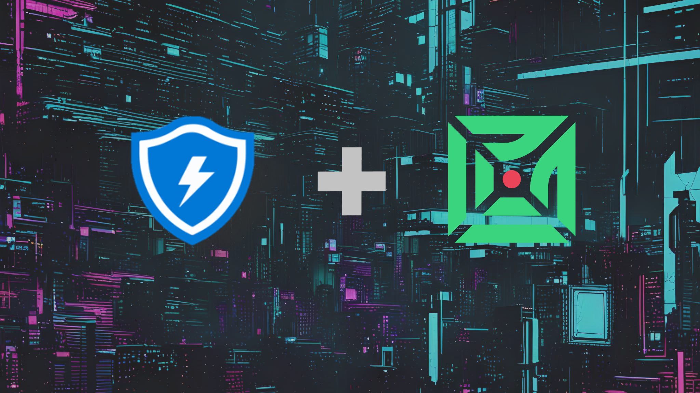
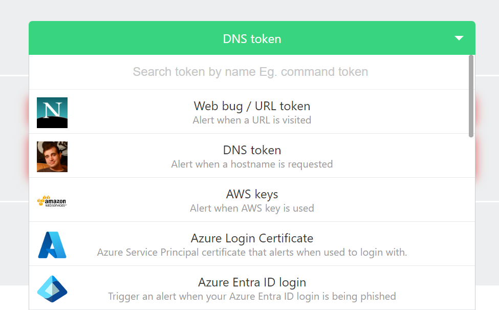
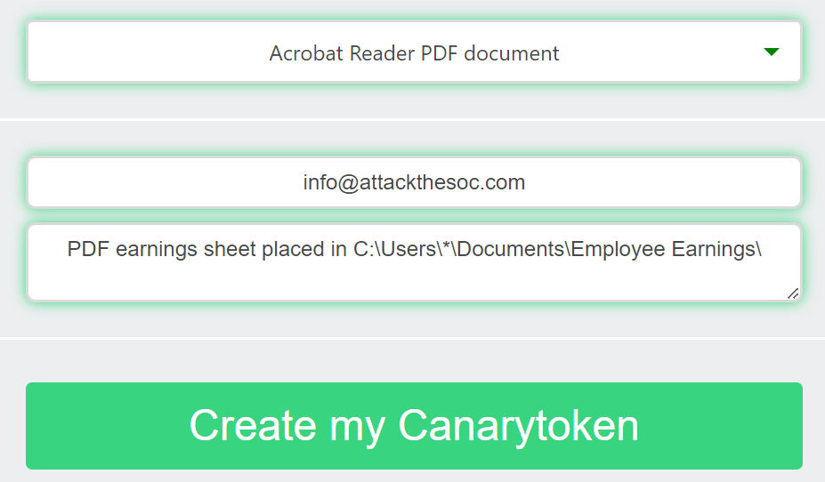
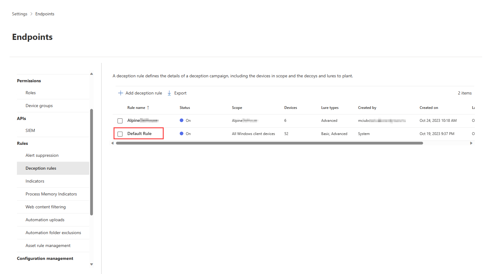
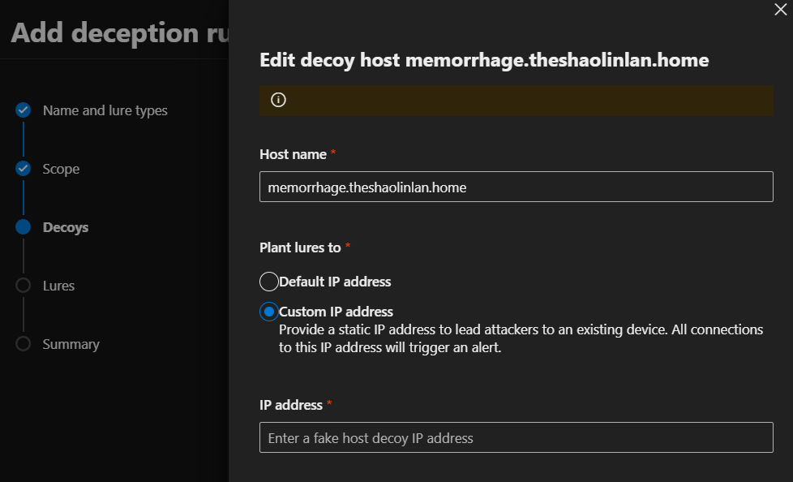
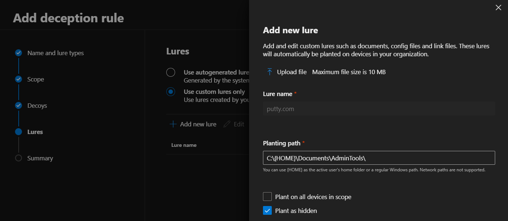
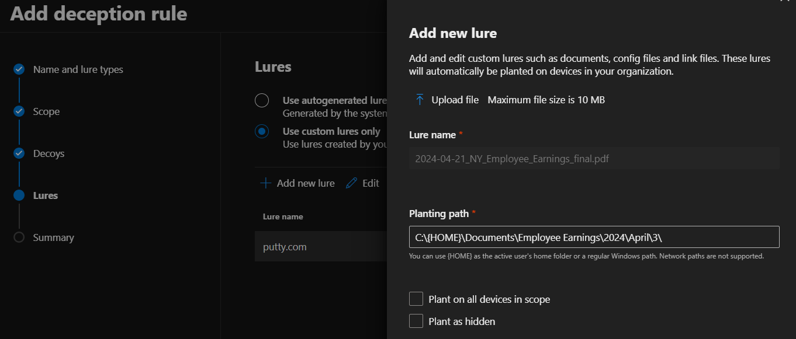

+++
title = "Stack Your Deception: Stacking MDE Deception Rules with Thinkst Canarytokens"
date = 2024-04-21T12:37:26-04:00
categories = ["Deception Engineering", "Azure"]
tags = ["deception", "canaries", "mde", "Defender XDR", "honeytokens"]
authors = ["Dylan Tenebruso"]
description = "add description"
draft = false
+++

A relatively new and straight forward feature pushed to client machines through Microsoft Defender for Endpoint as part of Defener XDR is the Deception capability. For those who may not know, **Deception** tech involves deploying decoy systems, data, or networks to deceive and trap attackers, enhancing threat detection and response capabilities. It helps organizations detect and thwart malicious activities by luring attackers away from their real targets.

Another amazing and straightforward deception toolset you should already have in your arsenal comes from Thinkst Applied Research and that's **Canarytokens**. For the price of $0 you can deploy various token types throughout your ecosystem and configure all alerts to go to a specified email address during token generation, [here](https://canarytokens.org/generate).

In this blog post, we ask and answer two questions. How can we stack these tools? Why would we even want to do that?
> [Microsoft Defender XDR Deception Capability Overview](https://learn.microsoft.com/en-us/microsoft-365/security/defender/deception-overview?view=o365-worldwide)
>
> [Configure the deception capability in Microsoft Defender XDR](https://learn.microsoft.com/en-us/microsoft-365/security/defender/configure-deception?view=o365-worldwide)
>
>[Thinkst Applied Research - What are CanaryTokens?](https://docs.canarytokens.org/guide/#what-are-canarytokens)
## Reviewing the Native Capabilities
### Defender XDR's Deception feature 
is a complete toolset offering you a way to create autogenerated or custom decoys and lures that you can then seamlessly deploy to your entire workforce, or to select systems via device tags. The configuration of these "*Deception rules*" comes in two varieties: **Basic** and **Advanced**. Here's an excerpt taken right from the MS Docs explaining the difference:
  * **Basic lures** – planted documents, link files, and the like that have no or minimal interaction with the customer environment.
  * **Advanced lures** – planted content like cached credentials and interceptions that respond or interact with the customer environment. For example, attackers might interact with decoy credentials that were injected responses to Active Directory queries, which can be used to sign in.
  
Deception lures are currently supported on Windows client devices, and according to the docs support for Server 2016 and later is planned for future development.

Throughout the configuration process you have multiple opportunities to either leave the autogenerated decoys and lures as they are or you can choose to customize them however you see fit.

### Thinkst Canarytokens
Canarytokens should be a staple in your deception playbooks which should be part of your greater detection strategy. You can't beat the price of free for their Canarytokens service and the rave reviews of the paid service are a telling tale of how well these solutions work in the field. A simple click of your mouse and the dropdown presents enough token types for you to dream up endless scenarios of how to catch the bad actors in your network from outside or from within.

Here are just a few of the token types you can use:
* Web bug / URL token
* DNS token
* AWS Keys
* Sensitive command token
* Custom exe / binary
* Adobe PDF

And the list goes on for quite a bit more.

You simply, enter the email address of where you want the alert to go when triggered. Configure any options you may be required depending on the token type and then download, deploy and profit!

Furthermore, they have open sourced their platform for you to deploy in the way of VMs, containers and even raspberry pi's throughout your network for total coverage. You'll also find tons of scripts developed by their team to aid in your development and deployment efforts.  [Thinkst AR GitHub](https://github.com/thinkst)

## The How: Stacking our deception tools
### The Setup
#### Comms
There's a key piece we first need to figure out and that's how to receive your Canarytoken alerts in a way that doesn't deviate from your norm. For starters, if you use a team messaging app such as MS Teams or Slack then you can grab the channel email address and stick it in the Canarytoken setup page to receive any alerts there.

Better yet, using an Azure logic app we can create an incident in Sentinel based on an email being received and keep the SOC in it's normal flow state. [Find the ARM template here](https://github.com/Azure/Azure-Sentinel/tree/master/Playbooks/Create%20Incidents%20with%20Email)

#### Generating the Canarytokens
Next thing we need are the actual tokens we want to deploy leveraging the Defender XDR deception rules. For this example, I'm only using two to demonstrate some variety of the tokens available to you while showing how the customizability of the deception rules in XDR allows us to extend our detection capabilities beyond what you get out of the box.

I first downloaded the portable version of putty.exe and then on [Canarytokens.com](https://canarytokens.com) chose the "Custom exe / binary" token option, uploaded the putty.exe file and Canarytoken was able to tokenize the binary.
Defender XDR Deception rules do not allow DLL or EXE files to be uploaded. The way I found to get around this and it may not always work, is to simply change the *.exe* extension to *.com* and it gets accepted.



Next token was a PDF token. For this all I had to do was enter an email address and description. Canarytokens provided me with the tokenized pdf that I simply renamed to "*2024-04-21_NY_Employee_Earnings_final.pdf*". 

### Configuring our Deception rule
In your Microsoft Defender XDR dashboard, to turn on the Deception capabilities, scroll to the bottom and select **Settings** > **Endpoints** > **Advanced features** to find the setting for *Deception* (it's toward the bottom of the Features list). Then to configure the rules, scroll a bit more on the endpoints menu and select **Deception rules**.


1. Click the **+ Add deception rule** button to get started
2. Give it a name and description then choose the lure type > Next
3. Decide on the scope, then hit Next
   * Are you deploying this to everyone? Or just to endpoints in Finance or HR? Plan, then select the device tags
   * Look to recent breaches and news to help you decide on how you might run your current deception campaign. You can always change it later.
4. Confirm the Decoys, then hit Next
   * These *Decoys* are autogenerated but you can easily change them by selecting the one which requires editing and selecting the  **Edit** button
   * One cool thing about the **Host** decoys is that you can customize the IP address. Are you utilizing Thinkst Canaries or their OpenCanary platform and you have honeypots in the network? Then why not point these decoys at those hosts?
    I've personally not tested using **Advanced** lures with custom decoy host IPs that point to OpenCanary systems. I'd be interested if the decoy activity produced via Advanced lures would trigger a canary alert? If you know, hit me up on [twitter](https://twitter.com/DylanInfosec)
   
   * Deception is not just about detection, it's also a strategy of trapping the attacker and wasting their time! Pile on that debt
5. Let's create some custom Lures. 
    1) **+ Add new lure** > Upload file > select one of the tokens we generated earlier
    2) Write out the path of where you want the token to live. 
      * For the exe: 
      
      ```SQL 
      C:\{HOME}\Documents\AdminTools\
      ```
      * For the PDF:
      
      ```SQL
      C:\{HOME}\Documents\Employee Earnings\2024\April\3\
      ```
    3) Select whether or not you want to deploy this on every device that's in-scope. Seeing the same file in the same spot on many devices is a pretty big sign of something *phishy*.
    4) Select whether the file should be hidden or not. Again, would this file be hidden? Will the attacker run *dir /a*?
    5) Click **Save**
6. Review everything and create by hitting **Save** again


That's it. It can take anywhere from 12-24+ hours for these rules to be created and land on boxes so don't stick around expecting to test it right away. Come back tomorrow and all should be ready then.

## The Why: Why stack? Aren't they each good enough?
Alright Pink, I get it, you're skeptical.


To answer your question, yes. Both of these products can stand on their own. Easily. But why not close the gaps no matter how narrow they may be? Leveraging the reach to your entire workforce at the click of a button via Defender XDR is something to take advantage of. Defender's deception tech was well thought out and stacked with Canarytokens the possibilities are endless. 

Tokenized lure docs that contain data pointing to decoys which double as an early stage alerting system is literally what canary tokens are for. Sure, you can have basic lures which mention the decoys in hopes of enticing an attacker into interacting with the decoy. But what if they don't take the bait?

No matter, because the lure itself was tokenized and you now know something is happening and you need to move!

Any small advantage we can get is one taken from them. And no, I'm not going to give you the "We have to win all the battles, they just need to win one" speech because it's a load. With detection-in-depth strategies like this, the attacker has to work a whole lot harder at winning without tripping any alarm bells. Leveling the playing field.

## Thank you for reading
I really hope this helped you think about some new strategies you may deploy in your network and perhaps introduced you to some new tools and features you need to get you hands on. Now you don't have any excuses. Get'em, deploy'em and sleep better because of it.

Until next time on, Attack the SOC!