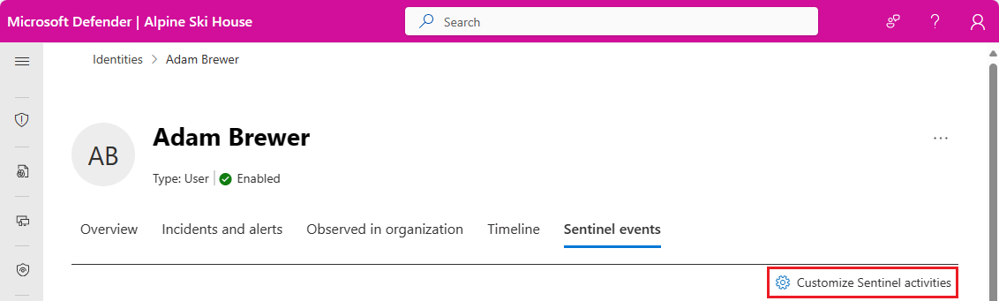
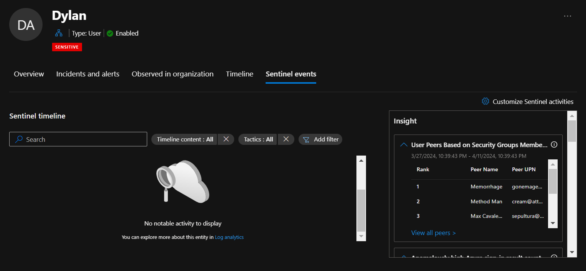
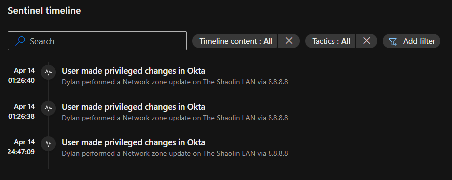

+++
title = 'Enhancing Your Entity Timelines: Sentinel Activities in the Unified Microsoft Defender XDR Portal'
description = 'With the recent release of the Microsoft unified security operations platform in the Defender portal I wanted to focus in on one specifically cool feature brought over that could help SOC analysts speed up their investigations.'
date = 2024-04-13T13:57:30-04:00
draft = false
tags = ['sentinel', 'xdr', 'secops']
categories = ['Azure']
authors = ['Dylan Tenebruso']
+++
With the recent release of the Microsoft unified security operations platform in the Defender portal which is the integration of Microsoft Sentinel and Microsoft Defender XDR, there has been A LOT to take in. Both mentally and technologically. All the new features and settings to take advantage of has been overwhelming in a really good way!

There's an endless amount of posts coming out about all of it so I figured why not add to the pile.

The specific feature I'm covering in this post is one that I haven't heard too much hype about but I personally think has loads of potential when it comes to making a SOCs life a whole lot easier. And that's:

## Sentinel activities: Bringing Entity behavior into the XDR portal
This is a feature still in preview that was brought into the Defender XDR portal via the Unified SOC platform. For the purpose of this post I'll be focusing on this feature within the XDR portal and not the Azure (Sentinel) portal where it lives under the **Entity behaviors** page.

 [MS Docs - Customize activities on entity page timelines](https://learn.microsoft.com/en-us/azure/sentinel/customize-entity-activities?tabs=defender)


You can find all of the OOtB "activities" by navigating to **Assets > Identities**, from there select an identity and **View User Page**. You will see a new tab added to the User Page labeled **Sentinel events**. 



You'll immediately notice two really cool things about this page.
1. There's a Sentinel timeline for notable activity with filters for:
   * Security Alerts
   * Bookmarks
   * Activities
   * Anomalies

2.  An **Insights** box containing loads of contextual data about the entity you're currently investigating
    * There are tables such as user peers based on group membership, UEBA insights, TI indicators related to user, User access permissions to Azure Subscriptions, and much more



There's already a lot we can dig into but I want to break it up and start small. I really want to take advantage of one specific feature and that's creating custom activities for entity pages.


But why, you ask? Because we have so much other data to bring in front of our analysts from so many other sources besides just our Microsoft products. We're X-tending our reach with XDR. This allows us to pull everything into one place. It's our job to clean it up and find what matters so we can quickly identify emerging threats and risks in our environment and action our findings in a timely manner with as little portal/tab/window hopping.
## Getting started
For this example, our goal is to create a new "Custom activity" that will aid an analyst in quickly identifying if the user they're currently looking at has performed any meaningful changes in Okta. 

Very simple example, yes. But I'm sure your head is already swirling with ideas.

If I may, for these Custom Activities I feel that they should remain simply *contextual*. We're not creating alerts here nor are we hunting. We have other places to do that in the XDR platform. Here we want to give the analyst high quality and digestible information that they can use to lead their investigation or response efforts in the correct direction. At least, that's my .02
### Creating Custom Sentinel activities from Custom logs
1. Go ahead and click the **Sentinel events** tab of any entity page (Identities, Devices, IPs, etc) and in the upper right-hand corner select **Customize Sentinel activities**
2. Once again, in the upper right-hand click the **+** to enter the *add activity* wizard
3. In the wizard, go ahead and give this activity a name of your choosing. I went with "*User made privileged changes in Okta*"
    * Add a detailed description of what this activity is and how it could be used to aid the analyst
    * For our purposes we set the Entity type to **Account** but if you went a different route go ahead and set that accordingly

That's it for this, click **Next**
### Activity Logic
Keep a few things in mind here from the MS Docs:

* We want to use "Strong identifiers" as this ensures one-to-one mapping between query results and the entity
    * Microsoft provides a table of strong identifier combinations [here](https://learn.microsoft.com/en-us/azure/sentinel/customize-entity-activities?tabs=azure#writing-the-activity-query)
    * This may also prove helpful, [Sentinel entity type references and schema](https://learn.microsoft.com/en-us/azure/sentinel/entities-reference)
* Query can contain up to 10 fields
* One of those projected fields has to be **TimeGenerated**

#### KQL
Let's go ahead and craft our query using an identifier (though "strong" is preferred). I'll simplify the query but please extrapolate and expand your own query to include whatever you want to get in front of your analysts
```SQL
OktaSSO
| where alternadeId =~ {{UPNSuffix}} //you can add the *Available identifiers* from the list below into your query
| where outcome_result_s =~ "SUCCESS" and (eventType_s =~ "app.oauth2.client.privelege.grant" or eventType_s =~ "user.account.privilege.grant")
| extend target = parse_json(target_s)
| mv-apply target on ( project target.displayName )
| project TimeGenerated, ActorDisplayName = actor_displayName_s, TargetDisplayName = target_displayName, ActorIPAddr = client_ipAddress_s, displayMessage_s
```
#### Activity title (as will appear in the timeline)
For this next part let's make sure we give the analyst that high-quality and digestable data
 - Again, we can use the *Available identifiers* but we can also use the outputs from our query in the same formatting style!
 ```html
 {{ActorDisplayName}} performed a {{displayMessage_s}} on {{TargetDisplayName}} via {{ActorIPaddr}}
 ```
 
Context context context


That's it. Click the Next button at the bottom to allow the *review + validate* process to take place. Hit **Create**

## How it works
According to the docs, every time you visit an entity page all enabled activites will run for that entity. 

If your query syntax is all good and an activity has occurred since publishing the custom activity, you will be immediately rewarded with the fruits of your labor.


If you're not seeing any results after having initiated a monitored activity my money is on the identifier. Be sure to read those docs linked above to ensure you're using the right identifier for your query.

## Observations
One thing you quickly notice is that clicking on the activities doesn't bring up any other action or any new information. It'd be cool if they could extend the **Go hunt** feature here to bring you to a query in the Advanced Hunting page to pivot off the data. Following up on this, the only data you do see is the data you put into the *Activity title* so make sure you get that data formatted in.

One other caveat I noticed was that you only see activities that occur after the publish time of the new custom activity you created. Meaning I don't see any historical lookups in the activity table. I performed monitored actions 5 times but only saw the 3 actions taken after publishing the activity.

Finally, I'm assuming these activities are being stored somewhere, otherwise I'd imagine that historical activities would show up. Given this assumption, it'd be really cool to see these activities in the entity timeline as well. Even if there was an api we could hit to pull these activities out and inject them into the entity timelines, I'd be happy. [WindowsDefenderATP API to access 'Event.Write' to timeline](https://learn.microsoft.com/en-us/microsoft-365/security/defender-endpoint/api/exposed-apis-create-app-webapp?view=o365-worldwide)


# Thank you for reading
Hopefully this helped you either learn about this feature or spark some ideas! Now go create something and share with the community

Until next time on, Attack the SOC!