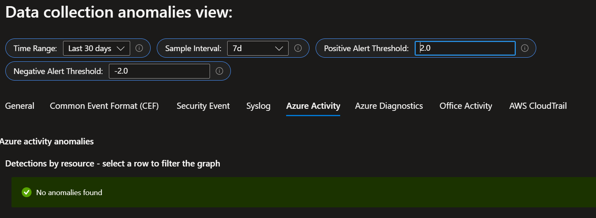
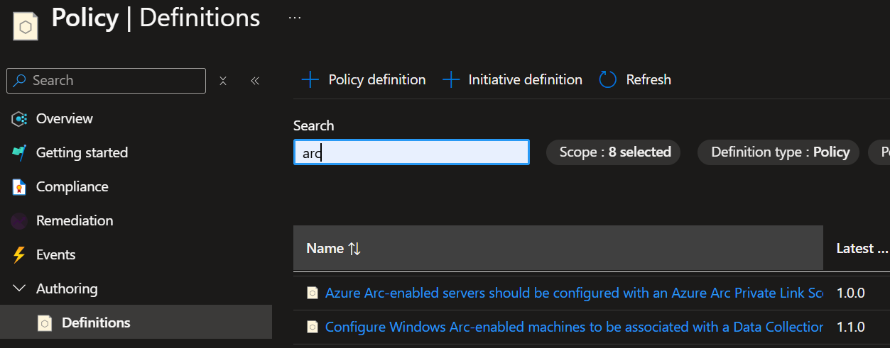
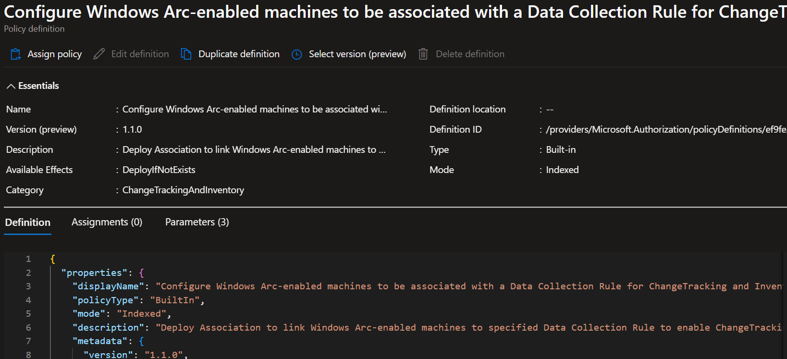
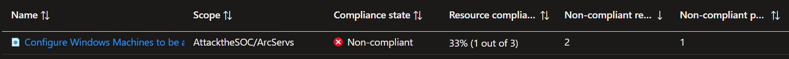
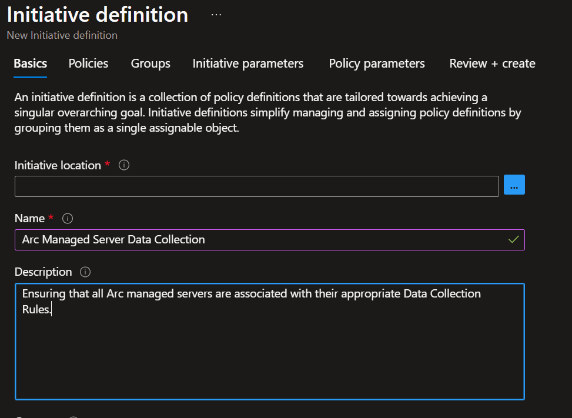
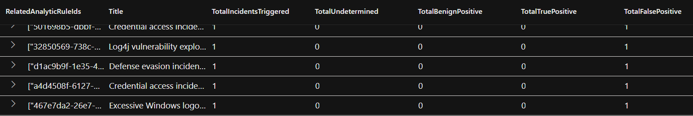
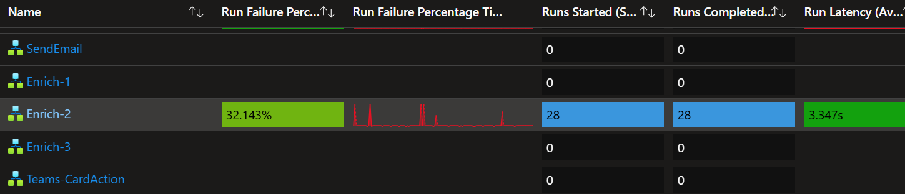
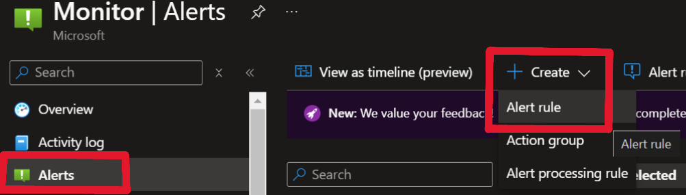

+++
title = "Optimizing the SOC"
date = 2024-12-07T18:32:18-04:00
categories = ["Defender", "Sentinel", "Azure"]
tags = ["Defender XDR", "SOAR", "SOC", "optimization"]
authors = ["Dylan Tenebruso"]
description = "Explore ways of optimizing alerts to reduce false positives, leveraging built-in tools to streamline operations, and implementing features that boost productivity for a more efficient and effective SOC."
draft = false
+++
Alright, so you got the blinky boxes and colorful dashboards showing data no one remembers why they wanted to see. You even puts emojis in all your KQL charts because you can. You're drooling at the sight of that "Enter prompt here.." bar and the budget is burning a hole in your pocket. 

Here's you:


Chasing down a goalpost that seemingly grew wings. If you turn around you'll see that you're hemorrhaging FPs, you have tons of undiagnosed system health alerts and you have some unknown unknowns, not because "that's just the nature of things" but because you haven't given yourself a minute to sit back and think.

In this post, we're going to look at some of the functionality that's built into the Microsoft Unified SOC Operations platform and some that isn't to help you clean up and get your operations center optimized and back to a clean state. A majority of this post  a collection of solutions I found throughout the past couple years and is the work of some other fantastic folks who took the time to build these solutions and share them with everyone. Give them a thanks if you implement it.

## Issues to Solve
1. Data Collection health
2. False-positives
3. Playbook Health
4. Att&ck Coverage

## Data Collection Health
### Sentinel Workbook

Do you know if any of your data collectors have stopped ingesting? Were you able to detect that anomalous uptick in events coming in from your DnsEvents table? To answer questions like this and so much more, you need to install the following Workbook from the Sentinel Content Hub.

[Data Collection Health Monitoring](https://learn.microsoft.com/en-us/azure/sentinel/monitor-data-connector-health) 

The MS Docs go into enough detail but for a quick overview, you get information such as the size of data over the specified time frame, the avg size per entry, and events per second. You can review visual trend data to identify what your data ingestion actually looks like throughout the weeks and months. 

What I love about this particular workbook is the second tab at the top, *Data collection anomalies*. This tab helps you to identify anomalies in your data collection baselines using [series decomposition](https://en.wikipedia.org/wiki/Decomposition_of_time_series), [linear regression](https://en.wikipedia.org/wiki/Linear_regression) and [Tukey's fences](https://en.wikipedia.org/wiki/Outlier#Tukey's_fences) which is the basis for a few series anomaly and outlier KQL functions. By adjusting the thresholds and sampling interval you should be able to quickly find areas of concern within your data.



One thing to note, ensure your *Time Range* to *Sample Interval* compliment each other. For example, your data collection on the weekend will be completely out of range from what you see during the week. So if you have 30 days for the range then choose 7 days for an interval. 60 days for range, then 14 days for interval. Adjust accordingly. 

You can very easily turn the data in this workbook into alerts by clicking the Log Analytics logo at the top-right corner of each chart to bring up a Logs blade. Now you have alerts for data collection trending out of your baseline.

### Data Ingestion Failure Alerts

Speaking of alerting on data collection failures, the awesome [Rod Trent](https://twitter.com/rodtrent) from Microsoft shared his solution on [How to be Notified When Microsoft Sentinel Data Stops Populating](https://rodtrent.substack.com/p/how-to-be-notified-when-microsoft). In his article Rod shares queries to identify data ingest failure and instructions on how to configure the analytic rules to ensure you are notified.

Of course, you're free to adjust the query to your preference. Let's assume you have a critical table that you want to be notified after 3 hours of no ingestion. Let's take the formula and adjust for just 3 hours:

60 seconds x 60 minutes x 3 hours = 10,800

So then:
```SQL
HuntingBookmark
| where TimeGenerated > ago(4h)
| summarize last_log = datetime_diff("second",now(), max(TimeGenerated))
| where last_log >= 10800
```

And then ensure you adjust the Query scheduling parameters to accommodate these changes:

| ***Run query every*** |  |
| -- | -- |
| 1 | Hours |


| ***Lookup data from the last*** |  |
| -- | -- |
| 4 | Hours |

You're all set.

### Intro to Azure Policy

Can you say with 100% certainty that every Arc managed server is associated with a DCR? How quickly can you identify non-compliant resources? Do you have a remediation plan in-place? Well there's a tool for that, Azure policy.



Exactly as it sounds, you use Azure Policy to develop policy definitions to help you enforce standards in your environment. You start by creating new policy definitions or by using any of the built-ins, which are essentially JSON formatted rules. These rules define conditions that you are requiring to be met by your resources. For example, we could require that Arc servers have the AMA (agent) installed and that the machine is associated with a Data collection rule(s).

[Learn more about Azure Policy here](https://learn.microsoft.com/en-us/azure/governance/policy/overview) 



There is a built in Policy Definition for this at Definition id: */providers/Microsoft.Authorization/policyDefinitions/ef9fe2ce-a588-4edd-829c-6247069dcfdb* 

In this Policy definition template, all you have to do is define a couple parameters such as the scope of the policy which would be the target subscription(s) and resource group(s) and our required Data collection rule via its Resource Id. Next we choose whether or not to allow this policy to create a remediation task. Yes, as in this policy definition will attempt to automatically remediate any non-compliant resources for us. Do note the creation of a system assigned managed identity to carry out the remedation tasks as you should have been expecting.

Finally, review and create. Your policy is then evaluated based on [various triggers](https://learn.microsoft.com/en-us/azure/governance/policy/how-to/get-compliance-data#evaluation-triggers) but as always I would recommend a good dose of patience before running over to the compliance dashboard. 



To review the compliance of your resources you go to Azure Policy > Compliance, then search for the policy definition name you created in the list. Clicking into your policy allows you to drill into the different resources and identify why they failed and if a remedation task was created.

Finally, for more efficient reporting and policy organization, you can group similar policy definitions into what is called an Initiative. Let's say we have multiple DCR based policy definitions, one for Windows Events, one for DNS, another for Syslog, etc. We could group these together into a single Initiative called "Arc Managed Server Data Collection". We would then define the policies we want in the scope of this initiative as well as conditions that would allow future policies be pulled into this initiative.



As you could imagine this is but a simple usecase for what Azure Policy is capable of. Here we're building peace of mind that our Data Collection from managed resources is covered whether they're existing or new.

## Alerts ....ugh
### A History of Alert Fatigue

Do you groan every time you open your incident queue, roll your eyes and then close the browser tab muttering to yourself "I'll get to those later"? Well, that's alert fatigue my friend and it's no joke. It affects your mental health putting you and team members at risk let alone your org as the job becomes tedious and boring.


A lot in this section is going to feel pretty common sense yet here we are.

[Dr. Anton Chauvkin](https://twitter.com/anton_chuvakin) has a great article on this phenomenon and lays some serious groundwork on how to start combatting this problem that has persisted for over half a century. Read ["Anton’s Alert Fatigue: The Study" here.](https://medium.com/anton-on-security/antons-alert-fatigue-the-study-0ac0e6f5621c)

This covers just about everything I was thinking of putting here and he adds a lot of great info and background on the problem presented. Go read it!

### Reviewing the Efficiency of our Analytic Rules

Done? Now let's move on to a resource that will help us identify our FP problem areas. A colleague of mine found this impressive query from our friend, [Bert-Jan](https://x.com/BertJanCyber) of [kqlquery.com](https://kqlquery.com/). His simple yet powerful [Analytic Rules Efficiency query](https://github.com/Bert-JanP/Hunting-Queries-Detection-Rules/blob/main/Sentinel/AnalyticsRulesEfficiency.md) pulls and categorizes all the alerts of the past 30 days in an easy to read format allowing you to quickly get to your problem areas.



With these results we can sus out the rules that are filling up our alert feeds and action them according to the game plan Dr. Anton Chauvkin laid out. One thing to note, is that any analytic rules not in the results should be reviewed just as well. These rules are running, and therefore scanning lines of data and costing you money. Are they actually doing anything useful for you?

As you action these rules ask yourself the following questions:
1. Why do I have this alert and/or do I have the means to action it?
2. Can I adjust the logic to lower the FP rate?
3. Can I disable the alerting on this rule or perhaps use it to enrich other alerts/incidents?


## Att&ck Coverage
### Are You Covering Your As... Att&ck Map?

Continuing our conversation on whether or not alerts that we have in our queue actually mean anything to us. There's a few ways we can go about answering that question. Luckily for us, MITRE has taken the step of creating a framework on which we can base some of our work. 

Another friend of ours, [Michalis Michalos](https://twitter.com/Cyb3rMik3) of [https://www.michalos.net/](https://www.michalos.net/) has written an in-depth guide on [Operationalizing MITRE ATT&CK with Microsoft Security - Part 1](https://www.michalos.net/2023/05/29/operationalizing-mitre-attck-with-microsoft-security-part-1/) and  [Part 2](https://www.michalos.net/2024/03/25/operationalizing-mitre-attck-with-microsoft-security-part-2/). In this guide, Michalis goes over how the Att&ck framework is utilized throughout the Microsoft Security ecosystem and how we can implement it in our detection and analytic rules. In part 2, he introduces the Sentinel Att&ck Map which is the greatest tool in assuring yourself and your supervisors that you are indeed covering your assets by offering a visual matrix with realtime mappings of the rule and queries you currently have in your environment. 

### Use Case Mapper Workbook (Now That's What I Call a Sentinel Workbook 3)

Yet another great find by my colleague was this awesome workbook just recently released by [Mario Cuomo](https://twitter.com/Mario_CuomoIT) with Microsoft and at [his website](https://mariocuomo.github.io/). His workbook(solution) [Use Cases Mapper](https://techcommunity.microsoft.com/blog/microsoftsentinelblog/introducing-the-use-cases-mapper-workbook/4202058) provides you with a tool to identify solutions (Analytic rules and Hunting queries) available in the Content Hub that map to specific Att&ck framework tactics and show you the coverage that you have. This in conjunction with the information you learned from Michalis should have you covered.


## Playbook Health
### Yet Another Sentinel Workbook

If you're utilizing "playbooks" or Logic Apps at all, and you absolutely should be, are you also monitoring their health? Do you know how many times they failed to run this past month? Do you know their average number of runs and average runtime?

If you responded "No" to any of those questions then go ahead and make sure you have the Microsoft provided workbook [Playbooks health monitoring (preview)](https://learn.microsoft.com/en-us/azure/sentinel/monitor-automation-health#use-the-health-monitoring-workbook). It provides you with a quick birds eye view of your automation environment, allowing you to quickly identify playbooks that have stopped working and automations that could be optimized to lower costs.



### Logic App Alert Rules

Visuals are always nice but for a low cost wouldn't it be great if we could receive an email that our playbook failed to run? That's where Alert Rules come into play.

Keep in mind, if you have an automations that run a lot, such as a playbook that enriches alerts with data on entities from the alert, you could be signing yourself up for a lot of messages. Might be better to go the workbook route there with some manual diagnosing.



I recommend going to the Monitor console > Alerts > Create > Alert Rule. You will have to do this one at a time (per logic app) as selecting more than one resource per Alert Rule could (and does) disable your ability to use Metric based signals. In the Alert Rule creation wizard, select the Logic app you want to scope this alert too. Next on the Signals tab, select the "Runs Failed" signal. Now you'll have to decide on the conditions that make the most sense for the logic app.

For this example, let's assume this logic app is non-critical and runs once a day.

| Property | Value|
| -- | -- |
| Threshold | Static |
| Aggregation type | Total |
| Operator | Less than or equal to |
| Unit | Count |
| Threshold | 1 |

| **When to evaluate** |  |
| -- | -- |
| Check every | 1 day |
| Lookback period | 3 days |

Now I set it like this as there might be a fluke where it fails for some reason, but corrects itself on the next run. Or maybe there's maintenance being done on the Microsoft automatione engines or the target API endpoint. This allows for failures of a non-critical automation but alerts me to prolonged failures.

Next, Actions. Select "Use quick actions" > Email, and your the rest is up to you. Hit Save. Add some details on the next tab, Review and create.... Rinse and repeat. Each one of these will probably be on average around $.10/month, not a big deal for most but something to be aware of.


## Honorable mentions
### SOC Optimization

You undoubtedly already know of the new [SOC Optimization tool](https://techcommunity.microsoft.com/t5/microsoft-sentinel-blog/soc-optimization-unlock-the-power-of-precision-driven-security/ba-p/4130589) which if you're not familiar, click the link and become acquainted. MS developed it specifically to help you and your team optimize your SOC Operations and utilize the entire platform the way it was supposed to be used. Is there a data source you're neglecting? An attack type you're ill equipped to detect? You'll find all of that and more in your optimization report.

I'm not going to go into detail here because Microsoft already did:

Read the Docs:
[SOC optimization overview](https://learn.microsoft.com/en-us/azure/sentinel/soc-optimization/soc-optimization-access?tabs=azure-portal)
[Recommendation's logic](https://learn.microsoft.com/en-us/azure/sentinel/soc-optimization/soc-optimization-reference)


### FastTrack

And last, if you're a prospective Microsoft customer or if you're already in the tools and are in need of a review and need guidance on best practices, look no further than the [Microsoft FastTrack team](https://www.microsoft.com/en-us/fasttrack). There are a few folks from the FastTrack team here in the socials community and a few that have been on a couple podcasts and it's easy to tell that they are a team that kills it. All very highly educated people that understand their tooling inside and out and even more importantly they know how to teach it.

## Final Thoughts
 
This is by no means an exhaustive list but is a great start for getting our security operations in order. We're ensuring that the data we need is coming in and we have ways to indeitify when this system breaks. Then we're getting rid of exhausting alerts to prevent fatigue in our team and open time for more rewarding work. Next we're ensuring the alerts that we do have have a usecase and can be mapped to meaningful TTPs. FInally we're looking at ways of creating accountability for our automations, alerts for failures and workbooks to visualize whats going on.

I'll leave you with these final words; a lot of times we're looking to implement the newest solution, create the next detection for the latest intel drop, and integrate another SAAS applications logstream. Rarely do we go back to tweak that noisy rule or add that line in our automation to make it run a little more efficiently. Instead of taking a "let's get it running now, I'll fix it up later" approach, commit to tackling it right now.

[Commit to taking time this week to clean things up](https://twitter.com/intent/tweet/?text=I'm%20taking%20some%20time%20this%20week%20to%20clean%20up%20and%20optimize%20the%20SOC)


# Thank you for reading

As always, I hope you found some of this useful and can walk away with a gameplan to make your environment a little more efficient. The folks mentioned in this article are all great members of the community who are constantly building and sharing, be sure to give them a follow, you will learn a lot and will not regret it. Now go create something and share it with the community.

Until next time on, Attack the SOC!