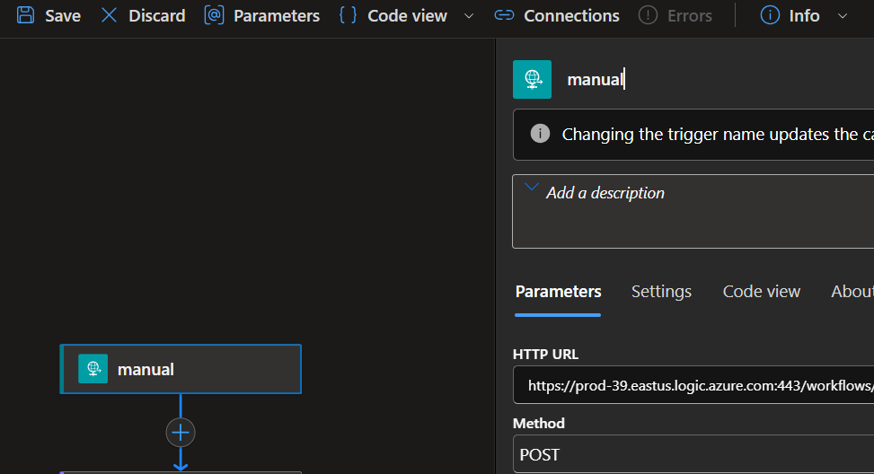
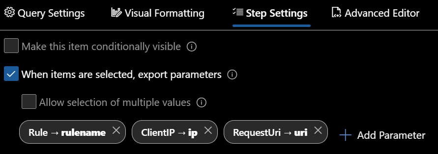
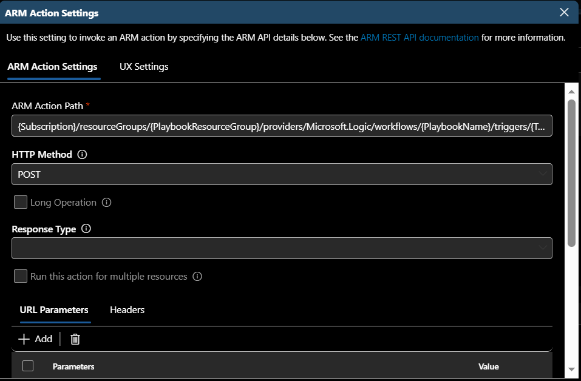
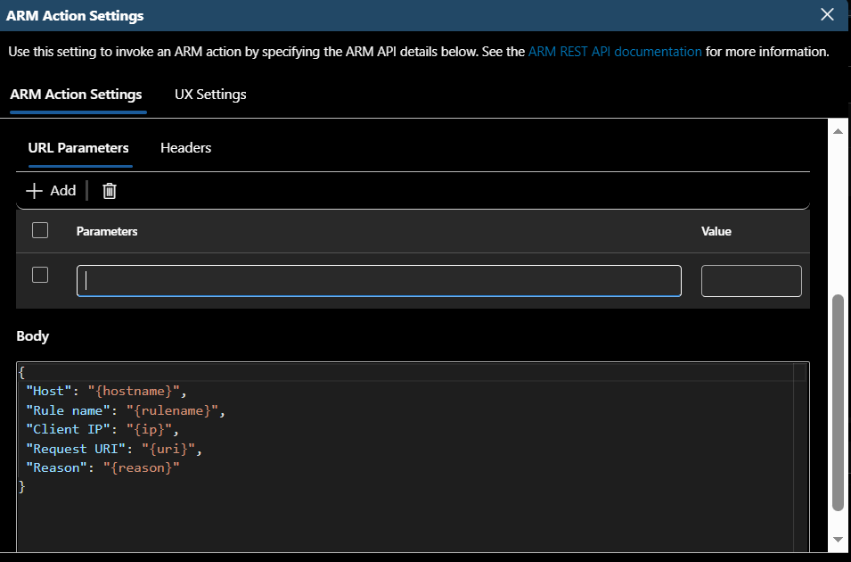
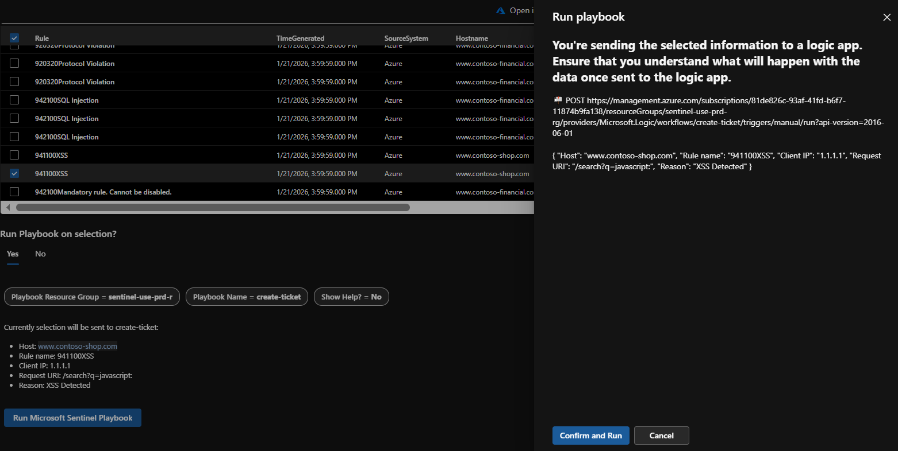
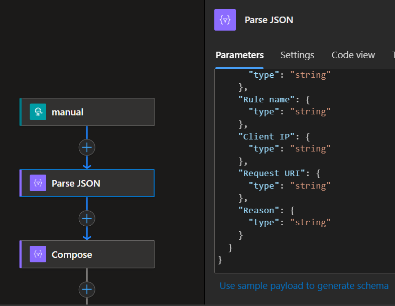
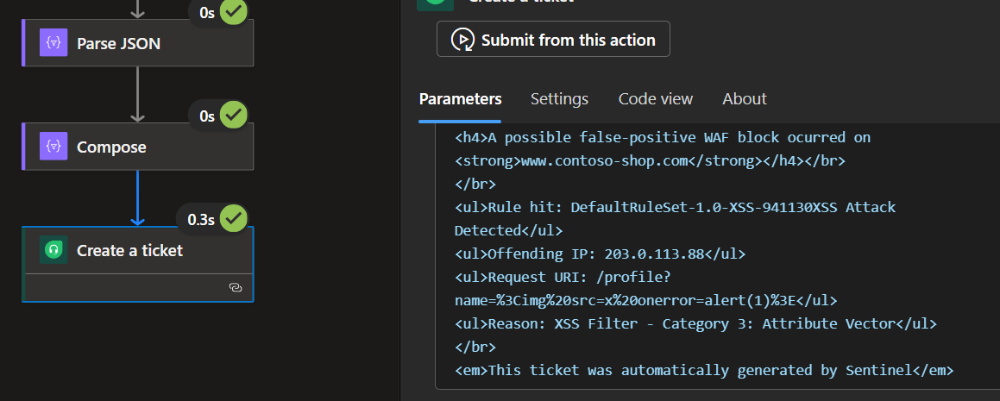
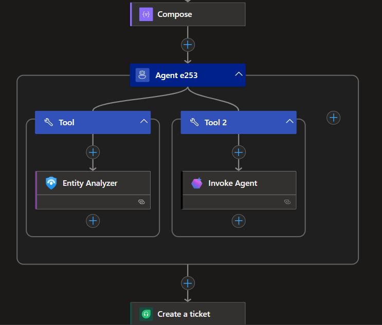

+++
title = "Operational Workbooks Episode 1: Running a Playbook from a Workbook"
date = 2026-04-12T05:21:43-00:00
categories = ["Sentinel", "Logic Apps", "Azure"]
tags = ["Sentinel", "Workbooks", "Automation"]
authors = ["Dylan Tenebruso"]
description = "Build an operational Sentinel Workbook that sends selected event data to a Logic App playbook via ARM action, enabling one-click ticketing, enrichment, and response workflows."
draft = false
+++
The right Workbook can make a world of difference in how you understand the data you're bringing into your workspace. I've built some pretty crap ones and have borne witness to works of art crafted with mission-driven care by clients. Personally, I think they may be one of the most overlooked features by teams getting into Sentinel, and I think I understand why.

Not to bore you, I put my theory at the end of this post, so scroll on down if you want to read it. For now, let's get to business on this installment of **Operational Workbooks**.

## Running a playbook *without* an incident/entity ID

Most of the materials and tutorials on running playbooks from a workbook seem to revolve around leveraging an [Incident ID](https://learn.microsoft.com/en-us/rest/api/securityinsights/incidents/run-playbook) or [Entity ID](https://learn.microsoft.com/en-us/rest/api/securityinsights/entities/run-playbook), which is still very helpful. The thing is, I needed the flexibility to send whatever data I wanted to the playbook.

Think of the possibilities: no longer bound to an Incident or Entity, we can peruse our dashboards, click any exportable column we want, and send that to the playbook of our choosing. We can create change management tickets with the click of a button, all of the data predictably formatted. We can modify AZFW, WAF, and other rules after identifying a false-positive block that bubbled up in a workbook table. We can revoke the sign-in sessions of a user we find performing suspicious actions. Update a watchlist. Add an IOC to threat intel...

In other words, if the data is viewable within a workbook and you can build a Logic App that uses that data... yeah, you get it. Heck, now that we have these [autonomous workflows in Logic Apps](https://learn.microsoft.com/en-us/azure/logic-apps/agent-workflows-concepts?tabs=consumption#autonomous-versus-conversational-agent-workflows), the possibilities seem endless. I digress.

For the purposes of this post, I'm using "playbook" and "Logic App" a bit interchangeably since the workbook is calling a Logic App trigger directly.

## Building the workflow

### The Logic App
Simply create a new Logic App and choose the "Request" trigger. That is, **When an HTTP request is received**.

> *If you created a new Logic App with autonomous workflow, this is already set up and waiting for you*

Rename the HTTP request action to something simple like "manual" and set the **Method** to "POST". Click **Save** at the top left of the screen.

You now have the head of your logic app completed, it should look something like this:



### The Workbook
#### Export data to parameters
Go to your Microsoft Defender portal > Microsoft Sentinel > Threat management > Workbooks. I'm using a modified version of the Microsoft Web Application Firewall (WAF) - Azure WAF workbook for the purposes of this article, but if you already have a specific use-case in mind then do it up!

 To follow along with this article, you can deploy the workbook here: [Modified Web Application Firewall Workbook](https://github.com/AttacktheSOC/Azure-SecOps/blob/main/Sentinel/Workbooks/Modified%20WAF%20Events%20playbook.json)


After finding or creating a table within the workbook that has the data you'd like to send over to the playbook, go to the **Step Settings** and check the box "When items are selected, export parameters".

Click "+ Add Parameter" and input the fields you'd like. For my workflow, I'll be sending this data to a playbook to auto-generate a change request on a false-positive WAF block. The idea is that when I click the row for a specific event, the specified column values will be exported as parameters. I'll use them to build out a simple JSON object that can then be parsed on the Logic App side and used to create a ticket.



When adding a new parameter, the *Field to export* is the name of the column that holds the value you're looking to export. *Parameter name* will be the keyword you use everywhere else within the workbook to call the exported value. You use the parameter by specifying it within curly braces (i.e. the parameter I created for the value in the Rule column will be called with "{rulename}").

#### Create the playbook call functionality
Now that we have the data configured to be exported, we'll create another Workbook element to send this data over and trigger our playbook using a Workbook Azure Resource Manager (ARM) Action.

You'll notice in the element group at the bottom of the Workbook that we have a few dropdown (selectable) parameters configured to use Azure Resource Graph (ARG) queries. These allow us to specify a Subscription, Resource Group, Resource Type, and eventually the actual playbook and its trigger name. We'll need these to craft the path of the ARM Action.

With the selectables created, we're able to easily craft the required URI, the anatomy of which, as you might already know, is: **/subscriptions/*{subscriptionId}*/resourceGroups/*{PlaybookResourceGroup}*/providers/Microsoft.Logic/workflows/*{PlaybookName}*/triggers/*{TriggerName}*/run?api-version=2016-06-01**

Now, all we'll need is the actual button. To do this we'll click the "+ Add" and then select, "Add actions". 

Within this new element we'll "+ Add" a new link. The *Link text* will be the text displayed on the button, set the *Action* to **Arm Action**, set the style to **Primary**, and finally click **Configure**.

We'll need to enter the exported parameters from our ARG dropdowns into the ARM Action Path and set the HTTP Method to **POST**.
```plaintext
{Subscription}/resourceGroups/{PlaybookResourceGroup}/providers/Microsoft.Logic/workflows/{PlaybookName}/triggers/{TriggerName}/run?api-version=2016-06-01
```



Scroll down and this is where you'll use those selected-row parameters to build the body of the HTTP POST. Considering data manipulation in a Logic App is nobody's favorite pastime, I'd recommend keeping it simple, but you can make it as complex as required.



After everything has been completed, hit that Done Editing button and Save. Give that **Run Microsoft Sentinel Playbook** button a press to ensure the POST request looks right.



 One thing to keep in mind here is that we're taking suspected attack data and projecting it as input into another process. URLs, code, process command lines, etc. are being taken out of our logs and sent somewhere. Make sure you understand where the data is going and how the data will be used. You might notice that a few of the example events (XSS) can perform HTML injection right in our workbook by using the URI parameter.

[KQL replace_string() - Microsoft Learn](https://learn.microsoft.com/en-us/kusto/query/replace-string-function?view=microsoft-sentinel)


### The Logic App
With our Workbook completed and confirmed to be sending the data we require, we can move on to the Logic App and do with the data our hearts desire...

Anyway, to be able to easily use our parameters within the Logic App, we'll need to set up a 'Parse JSON' action. Simply copy the JSON structure you created in the Workbook and, on the Parse JSON action, select the "Use sample payload to generate schema" button at the bottom of the action details blade. Paste in your JSON and hit Done, and it will automatically build your schema.



 If you suspect that some of your parameters may be empty at times (null), ensure that you account for that by modifying the **type** field for the specific value(s) with:
```json
"type": ["string", "null"]
```


Next is to format the data before sending it on home. And so begins our effort to make sure the data we send isn't processed or rendered unsafely on the receiving end. There are a few parsing functions that will automatically parse the input and, in the case of a URI, defang it for you. But you can also use the replace function to ensure the input/output is sanitized. Once again, you'll want to ensure the other side knows the data was modified.

Test with dummy data first.

For the example Logic App, I'm generating an HTML body to send in the form of a FreshDesk ticket so the appropriate teams can look into the suspected false positive. But again, if you know anything about Logic Apps, you can send or use this data however it's needed.

Because the request URI contains XSS attempts and this HTML will be rendered within the ticket body, I'm concatenating 'https://' with the hostname and request URI to feed the [uriPathAndQuery](https://learn.microsoft.com/en-us/azure/logic-apps/expression-functions-reference#uriPathAndQuery) function so it can be automatically parsed and encoded.

After formatting everything, we can add the final action to our Logic App and put the Output of our Compose into the input of that action. Set up any of the mandatory fields and hit Save. Go to the Logic App *Overview* tab and ensure that it's Enabled.

## Fruits of our labor
Go back to your Workbook and select the row/data you plan to send over to the playbook. Hit **Send Microsoft Sentinel Playbook**, confirm the data to send, and check the run history of your Logic App (🤞 all green checks) to ensure that your escaping, if required, worked as expected in the final action's input.



## Final Thoughts
Looking good, good lookin. What else can you add to the output to ensure the receiver has all the context they need? Instead of just single-row outputs, allow for the selection of multiple values. Take this workbook as a template to build out other operational workbooks.

Think outside the box... or outside this post. Don't limit yourself to just running a Logic App, see here how [the_jons3y ran a runbook out of their Workbook](https://www.reddit.com/r/azuredevops/comments/18m3pcx/run_runbook_via_arm_action_in_workbook/).

I'd be remiss to not acknowledge the ever-growing interest in how agents can be injected into just about every workflow in our lives. Begs the question, can some of your needs be handled by agentic reasoning? I'm sure they can and perhaps that is what we'll explore in the next installment of **Operational Workbooks**.



### Meretricious Dashboard Theory
You stuck around this long? Wow. Ok then, get your tinfoil hats on.

The theory goes that a lot of today's SOCs are managed, led, and architected by the same folks who were coming up in the Infosec world back when Splunk was making a lot of noise in the industry. One of the biggest buzzwords at that time was "Dashboards." Every CISO needed a ridiculously colorful dashboard with all the pie graphs, line charts, and histograms one could ever desire. Pure data gluttony. A special subsection of the third circle was designated for these folks.

Eventually, it became an industry meme. As those analysts grew into leading roles we kept our distance from being the CISO with wall-o-monitors doused in colorful widgets. Though a wall of monitors is still pretty cool in my book.
In the end, the stigma stuck and unfortunately some orgs don't take the time to work out what true value these workbooks/dashboards can bring.

Anyway, this is just my theory. 

# Thank you for reading
As always, I hope you walk away from this article with another tool in your belt, an idea in your gray matter, and a concept locked in. Build something cool, make you and your team's day a bit easier to get through. If it works for you, consider sharing it with the community.

Until next time on, Attack the SOC!


