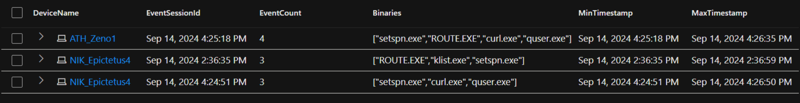

+++
title = "Practical Temporal Proximity in KQL"
date = 2024-09-15T13:48:18-04:00
categories = ["KQL", "Defender", "Advanced Hunting", "Detection Engineering", "Threat Hunting"]
tags = ["Temporal Proximity", "mde", "xdr", "kql" ]
authors = ["Dylan Tenebruso"]
description = "Practical approach to temporal proximity via KQL to identify patterns and potential security incidents."
draft = false
+++

Temporal Proximity in Information Security refers to the occurrence of two or more related events, similar or different in nature, within a specified time frame. This concept is essential for identifying patterns, correlations, and potential security incidents based on the timing and sequence of these events.


## Reliable Data Sources

This may sound simple enough but it's no easy task when considering the amount of data you must first wade through. Furthermore, doing this in Defender XDR is made slightly more complicated due to the limitations of MDEs telemetry.


Olaf Hartong wrote a wonderfully insightful series on MDE Internals which covers pertinent information not only for this article but your day-to-day work with MDE. Read his series: [MDE Internals](https://medium.com/falconforce/sysmon-vs-microsoft-defender-for-endpoint-mde-internals-0x01-1e5663b10347)


Understanding not only the data that you have in front of you but how that data is collected will make a major difference in whether or not your detections ever deliver results. For example, let's say you went to create a detection based on libraries loaded in a particular order or within a specific timespan in an effort to detect a strain of malware. 

Well, you would learn the lesson I learned a while back that DeviceImageLoadEvents isn't going to be of any help whatsoever, at least not at any acceptable rate. Moral of the story, read Olaf's work and know your tools!

## Temporal Proximity with KQL

**The Scenario**: You've been tasked with identifying when an APT lands on an endpoint and has hands-on-keyboard.
You start by researching past intrusion reports:

[The DFIR Report](https://thedfirreport.com/) - Real Intrusions by Real Attackers, The Truth Behind the Intrusion


**Findings and Plan of Action**: You create a list of the most common commands run by an attacker post exploitation and identify a relative time frame of 5 minutes between any two commands. You filter your findings down to commands with a purpose.

```SQL
let susProcs = dynamic(["route.exe", "quser.exe", "curl.exe", "setspn.exe", "klist.exe"]);
```

You set out to create a detection that attempts to identify when at least 3 of these processes are launched within 5 minutes of each other. These constraints should ensure a relatively low false-positives rate.

#### Bin There, Done That: Why We Don't Detect with Bin(s)
Look, bin() is great for a lot of things but it probably isn't as useful as you think it is for your detections. The way bin works is by rounding the datetime value to fit into buckets set at an interval of your choosing. Problem is that the "starting point" of bin is predefined.
But what about bin_at() ? Sure, it'll let you set the starting point but the same issue persists regardless. See here:
```SQL
let ProcessEvents = datatable(Timestamp: datetime, ProcessName: string)
[
    datetime(2024-09-15 12:00:59), "ProcessA",
    datetime(2024-09-15 12:01:05), "ProcessB",
    datetime(2024-09-15 12:01:15), "ProcessC",
    datetime(2024-09-15 12:01:55), "ProcessD",
    datetime(2024-09-15 12:02:01), "ProcessE"
];
ProcessEvents
| extend BinTime = bin(Timestamp, 1m)
| summarize EventsCount = count() by BinTime
| order by BinTime asc
``` 

The output of this would be as follows:
| BinTime              | EventsCount |
|----------------------|-------------|
| 2024-09-15 12:00:00  | 1           |
| 2024-09-15 12:01:00  | 3           |
| 2024-09-15 12:02:00  | 1           |

As you can see, bin makes your detections unreliable as events in temporal proximity of each other can fall into separate buckets.

#### Not Quite Time-Masters Yet: Why NRT isn't the Solution (For Now)
NRT detections are extremely useful for high severity alerts where you need to know something happened as close to minute 0 as possible. We absolutely could have an NRT analytic rule that looks 30 minutes in the past and summarizes the events to identify what we're looking for. And maybe this will work for 75% of the cases.

Unfortunately, there are some limitations that prevent it from being the answer to all our problems. There's a great blog post on it here by Sandor Tokesi on their blog, Senturean. Check it out: [Near-Real-Time rule restrictions](https://www.senturean.com/posts/22_01_24_nrt/)

> Something, something... know your tools.. something, dark side..  -*Palpatine (probably)*

### row_window_session: The Goldilocks function for Temporal Proximity
This useful little windows function does everything we need and once you learn how to harness its power, the detection possibilities will feel endless.

 KQL Docs - [row_window_session](https://learn.microsoft.com/en-us/kusto/query/row-window-session-function)

```SQL
row_window_session ( *Expr , *MaxDistanceFromFirst , *MaxDistanceBetweenNeighbors [, Restart] )
```
\* = required

As the name states, this function creates "session windows" based on an initial datetime *Expression*, think TimeGenerated or Timestamp. It uses this value/column to determine if other rows are within the same "session" depending on the other arguments.

<u>MaxDistanceFromFirst</u>(timespan) helps the function determine when a new session should be started. If set to 5 minutes, it takes the first row and starts the session on that datetime. The "SessionID" == first row datetime. Any subsequent rows within 5 minutes will have the same SessionID. 
Let's say row 11 is 6 minutes away from the first row. A new SessionID is started and will be equal to this events datetime and so on.

<u>MaxDistanceBetweenNeighbors</u>(timespan) is exactly as it sounds. Not only will it collect events within the MaxDistanceFromFirst  but you can also specify an allowed timespan between rows. Revisiting our example above, let's say that row 11 is 6 minutes away from the first row but just 1 minute from row 10. row_session_window(Timestamp, 5m, 1m), in this case, row 11 will be pulled into the session window that started on row 1.

<u>Restart</u> allows us to define a boolean expression which helps the function determine whether or not the current row should be incorporated into the current SessionID or if a new session window should be started. For example, row_session_window(Timestamp, 5m, 1m, DeviceName != prev(DeviceName)) will ensure that even if the current row is within 1 minute of the previous one, if the DeviceName is not the same (resolves to *true*) then start a new SessionID.

That last sentence brings us to a requirement which is that data must be serialized before this function is called. This can be done via a serialization operator and this is true of all window functions, read more here:

KQL Docs - [Serialize operator](https://learn.microsoft.com/en-us/kusto/query/serialize-operator)

KQL Docs - [Window Functions](https://learn.microsoft.com/en-us/kusto/query/window-functions)


## KQL 
### No More Time for Talk: The Solution
So we have our research, our conditions, and we have the function. Let's write out the KQL query.

```SQL
// --initialize the list of APT commands with a purpose
let susProcs = dynamic(["route.exe", "quser.exe", "curl.exe", "setspn.exe", "klist.exe"]);
let events =
DeviceProcessEvents
| where ProcessVersionInfoOriginalFileName in (susProcs)
| project DeviceName, Timestamp, FileName;
events
// --lets serialize the events by DeviceName first and then by timestamp
| sort by DeviceName, Timestamp asc 
// --Create session IDs collecting events within a 5 minute window of the first event or the previous event of the same session and matching device name
| extend EventSessionId = row_window_session(Timestamp, 5m, 5m, DeviceName != prev(DeviceName))
| summarize EventCount = dcount(FileName), Binaries = make_set(FileName), MinTimestamp = min(Timestamp), MaxTimestamp = max(Timestamp) by DeviceName, EventSessionId
| where EventCount >= 3
| order by DeviceName, MinTimestamp asc
```

You can find [this KQL detection](https://github.com/AttacktheSOC/Azure-SecOps/blob/35b291772454457d28053497019a582941b57b40/KQL/Endpoint/AbnormalRateInterestingCommands.kql) and more at [GitHub - AttacktheSOC: Azure-SecOps](https://github.com/AttacktheSOC/Azure-SecOps)


The results:


| DeviceName     | EventSessionId         | EventCount | Binaries                                              | MinTimestamp            | MaxTimestamp            |
|----------------|------------------------|------------|-------------------------------------------------------|-------------------------|-------------------------|
| ATH_Zeno1      | Sep 14, 2024 4:25:18 PM | 4          | ["setspn.exe", "ROUTE.EXE", "curl.exe", "quser.exe"]   | Sep 14, 2024 4:25:18 PM | Sep 14, 2024 4:26:35 PM |
| NIK_Epictetus4 | Sep 14, 2024 2:36:35 PM | 3          | ["ROUTE.EXE", "klist.exe", "setspn.exe"]               | Sep 14, 2024 2:36:35 PM | Sep 14, 2024 2:36:59 PM |
| NIK_Epictetus4 | Sep 14, 2024 4:24:51 PM | 3          | ["setspn.exe", "curl.exe", "quser.exe"]                | Sep 14, 2024 4:24:51 PM | Sep 14, 2024 4:26:50 PM |

## Final Thoughts

The example in this article was purposely less-than-realistic as my hope is that the material was explained in a way that enables you to grasp the idea and then make it work in the countless other ways you need it to work in your environment. Chop it up, add to it, flip the concept. And ofc you can certainly use the query above as a starting point!

Remember how our Restart expression was set to DeviceName != prev(DeviceName)? What if we wanted to correlate remote session activity between two computers and needed to have a "session window" that included activity regardless of DeviceName? What other columns can you match on to tie activity into sessions from multiple devices/users?

How could we use this to identify possible C2 beacon traffic?

Don't forget to test all steps in your query before deploying it. For example, ProcessVersionInfoOriginalFileName won't get everything you think it will. Instead of processes maybe you want specific command line arguments. 

What other data are you collecting that can now help you correlate activity between two or more different data sources?


# Thank you for reading

As always, I hope this helped you get a grasp on some new ideas! Hoping you learned something new. Now go create something and share it with the community.

Until next time on, Attack the SOC!
